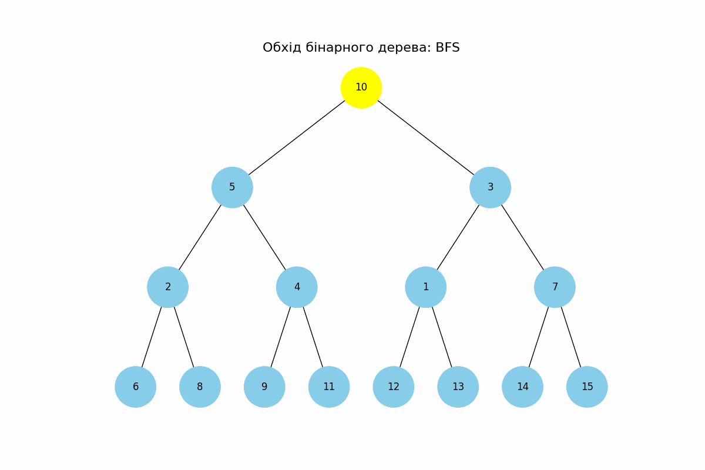
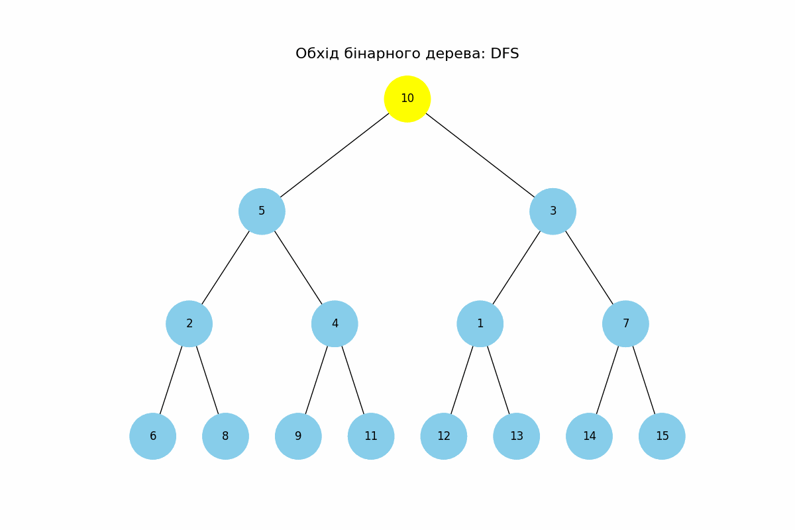
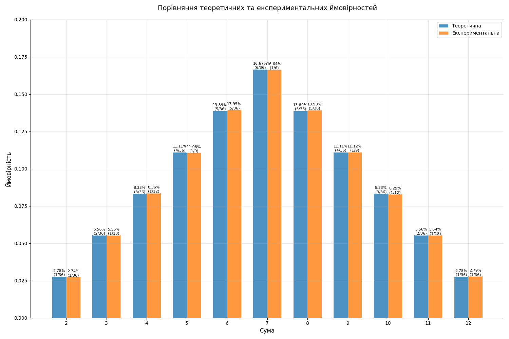

# goit-algo-fp
## Фінальний проєкт

Перед початком роботи:
1. Версія **Python: >=3.10**
2. Cтворюємо віртуальне середовище (Python: >=3.10) `.env`: `python -m venv .env`
3. Активуємо (відповідно до своєї ОС): `source .env/bin/activate`
4. Інсталюємо залежності: `pip install -r requirements.txt`
5. По завершенню роботи деактивовуємо: `deactivate`

## Завдання 1. Структури даних. Сортування. Робота з однозв'язним списком.
Для реалізації однозв'язного списку (приклад реалізації можна взяти з конспекту) необхідно:
- написати функцію, яка реалізує реверсування однозв'язного списку, змінюючи посилання між вузлами;
- розробити алгоритм сортування для однозв'язного списку, наприклад, сортування вставками або злиттям;
- написати функцію, що об'єднує два відсортовані однозв'язні списки в один відсортований список.

### Критерії оцінювання:
- Реалізовано функцію реверсування однозв'язного списку, яка змінює посилання між вузлами. Код виконується.
- Програмно реалізовано алгоритм сортування (функцію) для однозв'язного списку. Код виконується.
- Реалізовано функцію, що об'єднує два відсортовані однозв'язні списки в один відсортований список. Код виконується.

### Ресурси
- [task1.py](./task1.py)
- [LinkedList.py](./LinkedList.py)
- [Module helpers](./helpers)

## Завдання 2. Рекурсія. Створення фрактала “дерево Піфагора” за допомогою рекурсії.
Необхідно написати програму на Python, яка використовує рекурсію для створення фрактала “дерево Піфагора”. Програма має візуалізувати фрактал “дерево Піфагора”, і користувач повинен мати можливість вказати рівень рекурсії.

### Критерії оцінювання:
- Код виконується. Програма візуалізує фрактал “дерево Піфагора”.
- Користувач має можливість вказати рівень рекурсії.

### Ресурси
- [task2.py](./task2.py)
- [Module helpers](./helpers)

## Завдання 3. Дерева, алгоритм Дейкстри.
Розробіть алгоритм Дейкстри для знаходження найкоротших шляхів у зваженому графі, використовуючи бінарну купу. Завдання включає створення графа, використання піраміди для оптимізації вибору вершин та обчислення найкоротших шляхів від початкової вершини до всіх інших.

### Критерії оцінювання:
- Програмно реалізовано алгоритм Дейкстри для знаходження найкоротшого шляху у графі з використанням бінарної купи (піраміди).
- У межах реалізації завдання створено граф, використано піраміду для оптимізації вибору вершин та виконано обчислення найкоротших шляхів від початкової вершини до всіх інших.

### Ресурси
- [task3.py](./task3.py)
- [graph_data.py](./graph_data.py)
- [Module helpers](./helpers)

## Завдання 4. Візуалізація піраміди.
Наступний код виконує побудову бінарних дерев. Виконайте аналіз коду, щоб зрозуміти, як він працює.
```python
import uuid

import networkx as nx
import matplotlib.pyplot as plt


class Node:
  def __init__(self, key, color="skyblue"):
    self.left = None
    self.right = None
    self.val = key
    self.color = color # Додатковий аргумент для зберігання кольору вузла
    self.id = str(uuid.uuid4()) # Унікальний ідентифікатор для кожного вузла


def add_edges(graph, node, pos, x=0, y=0, layer=1):
  if node is not None:
    graph.add_node(node.id, color=node.color, label=node.val) # Використання id та збереження значення вузла
    if node.left:
      graph.add_edge(node.id, node.left.id)
      l = x - 1 / 2 ** layer
      pos[node.left.id] = (l, y - 1)
      l = add_edges(graph, node.left, pos, x=l, y=y - 1, layer=layer + 1)
    if node.right:
      graph.add_edge(node.id, node.right.id)
      r = x + 1 / 2 ** layer
      pos[node.right.id] = (r, y - 1)
      r = add_edges(graph, node.right, pos, x=r, y=y - 1, layer=layer + 1)
  return graph


def draw_tree(tree_root):
  tree = nx.DiGraph()
  pos = {tree_root.id: (0, 0)}
  tree = add_edges(tree, tree_root, pos)

  colors = [node[1]['color'] for node in tree.nodes(data=True)]
  labels = {node[0]: node[1]['label'] for node in tree.nodes(data=True)} # Використовуйте значення вузла для міток

  plt.figure(figsize=(8, 5))
  nx.draw(tree, pos=pos, labels=labels, arrows=False, node_size=2500, node_color=colors)
  plt.show()


# Створення дерева
root = Node(0)
root.left = Node(4)
root.left.left = Node(5)
root.left.right = Node(10)
root.right = Node(1)
root.right.left = Node(3)

# Відображення дерева
draw_tree(root)
```
Використовуючи як базу цей код, побудуйте функцію, що буде візуалізувати бінарну купу.

👉🏻 Примітка. Суть завдання полягає у створенні дерева із купи.

### Критерії оцінювання:
- Код виконується. Функція візуалізує бінарну купу.

### Ресурси
- [task4.py](./task4.py)
- [BinTree.py](./BinTree.py)
- [Module helpers](./helpers)

## Завдання 5. Візуалізація обходу бінарного дерева
Використовуючи код із завдання 4 для побудови бінарного дерева, необхідно створити програму на Python, яка візуалізує обходи дерева: у глибину та в ширину.
Вона повинна відображати кожен крок у вузлах з різними кольорами, використовуючи 16-систему RGB (приклад `#1296F0`). Кольори вузлів мають змінюватися від темних до світлих відтінків, залежно від послідовності обходу. Кожен вузол при його відвідуванні має отримувати унікальний колір, який візуально відображає порядок обходу.

👉🏻 Примітка. Використовуйте стек та чергу, НЕ рекурсію

### Критерії оцінювання:
- Програмно реалізовано алгоритми `DFS` і `BFS` для візуалізації обходу дерева в глибину та в ширину. Використано стек та чергу.
- Кольори вузлів змінюються від темних до світлих відтінків залежно від порядку обходу.





### Ресурси
- [task5.py](./task5.py)
- [task4.py](./task4.py)
- [BinTree.py](./BinTree.py)
- [BFS_traversal.gif](./BFS_traversal.gif)
- [DFS_traversal.gif](./DFS_traversal.gif)
- [Module helpers](./helpers)

## Завдання 6. Жадібні алгоритми та динамічне програмування
Необхідно написати програму на Python, яка використовує два підходи — жадібний алгоритм та алгоритм динамічного програмування для розв’язання задачі вибору їжі з найбільшою сумарною калорійністю в межах обмеженого бюджету.
Кожен вид їжі має вказану вартість і калорійність. Дані про їжу представлені у вигляді словника, де ключ — назва страви, а значення — це словник з вартістю та калорійністю.
```python
items = {
    "pizza": {"cost": 50, "calories": 300},
    "hamburger": {"cost": 40, "calories": 250},
    "hot-dog": {"cost": 30, "calories": 200},
    "pepsi": {"cost": 10, "calories": 100},
    "cola": {"cost": 15, "calories": 220},
    "potato": {"cost": 25, "calories": 350}
}
```
Розробіть функцію `greedy_algorithm` жадібного алгоритму, яка вибирає страви, максимізуючи співвідношення калорій до вартості, не перевищуючи заданий бюджет.
Для реалізації алгоритму динамічного програмування створіть функцію `dynamic_programming`, яка обчислює оптимальний набір страв для максимізації калорійності при заданому бюджеті.

### Критерії оцінювання:
- Програмно реалізовано функцію, яка використовує принцип жадібного алгоритму. Код виконується і повертає назви страв, максимізуючи співвідношення калорій до вартості, не перевищуючи заданий бюджет.
- Програмно реалізовано функцію, яка використовує принцип динамічного програмування. Код виконується і повертає оптимальний набір страв для максимізації калорійності при заданому бюджеті.

### Ресурси
- [task6.py](./task6.py)
- [Module helpers](./helpers)

## Завдання 7. Використання методу Монте-Карло.
Необхідно написати програму на Python, яка імітує велику кількість кидків кубиків, обчислює суми чисел, які випадають на кубиках, і визначає ймовірність кожної можливої суми.
Створіть симуляцію, де два кубики кидаються велику кількість разів. Для кожного кидка визначте суму чисел, які випали на обох кубиках. Підрахуйте, скільки разів кожна можлива сума (від `2` до `12`) з’являється у процесі симуляції. Використовуючи ці дані, обчисліть імовірність кожної суми.
На основі проведених імітацій створіть таблицю або графік, який відображає ймовірності кожної суми, виявлені за допомогою методу Монте-Карло.

Таблиця ймовірностей сум при киданні двох кубиків виглядає наступним чином.


Порівняйте отримані за допомогою методу Монте-Карло результати з аналітичними розрахунками, наведеними в таблиці вище.

### Критерії оцінювання:
- Програмно реалізовано алгоритм для моделювання кидання двох ігрових кубиків і побудови таблиці сум та їх імовірностей за допомогою методу Монте-Карло.
- Код виконується та імітує велику кількість кидків кубиків, обчислює суми чисел, які випадають на кубиках, підраховує, скільки разів кожна можлива сума з’являється у процесі симуляції, і визначає ймовірність кожної можливої суми.
- Створено таблицю або графік, який відображає ймовірності кожної суми, виявлені за допомогою методу Монте-Карло.
- Зроблено висновки щодо правильності розрахунків шляхом порівняння отриманих за допомогою методу Монте-Карло результатів та результатів аналітичних розрахунків. Висновки оформлено у вигляді файлу `readme.md` фінального завдання.

## Висновки щодо правильності розрахунків

У ході виконання завдання було проведено симуляцію кидання двох кубиків методом Монте-Карло з використанням **1,000,000** ітерацій. Метою було обчислити експериментальні ймовірності сум, які можуть випасти при киданні двох кубиків, та порівняти їх з теоретичними ймовірностями.

## Розподіл ймовірностей
При киданні двох шестигранних кубиків, можливі суми варіюються від **2** до **12**. Теоретичні ймовірності цих сум визначаються кількістю способів, якими можна отримати кожну суму:
- **Сума 7**: Найбільш ймовірна, оскільки існує **6** комбінацій (1+6, 2+5, 3+4, 4+3, 5+2, 6+1).
- **Суми 2 та 12**: Найменш ймовірні, оскільки є лише 1 комбінація для кожної (1+1 та 6+6 відповідно).
- Розподіл ймовірностей має **симетричну форму**, де ймовірності зростають від сум **2** та **12** до суми **7**, після чого зменшуються.

### Порівняльна таблиця ймовірностей

| Сума | Теоретична ймовірність | Експериментальна ймовірність | Різниця (%) |
|------|------------------------|------------------------------|-------------|
| 2    | 2.78% (1/36)           | 2.74% (1/36)                 | 0.034078    |
| 3    | 5.56% (2/36)           | 5.55% (1/18)                 | 0.001156    |
| 4    | 8.33% (3/36)           | 8.36% (1/12)                 | 0.029367    |
| 5    | 11.11% (4/36)          | 11.08% (1/9)                 | 0.032211    |
| 6    | 13.89% (5/36)          | 13.95% (5/36)                | 0.059911    |
| 7    | 16.67% (6/36)          | 16.64% (1/6)                 | 0.022167    |
| 8    | 13.89% (5/36)          | 13.93% (5/36)                | 0.040011    |
| 9    | 11.11% (4/36)          | 11.12% (1/9)                 | 0.011589    |
| 10   | 8.33% (3/36)           | 8.29% (1/12)                 | 0.044533    |
| 11   | 5.56% (2/36)           | 5.54% (1/18)                 | 0.016856    |
| 12   | 2.78% (1/36)           | 2.79% (1/36)                 | 0.010122    |

*Примітка: Різниця (%) обчислюється як абсолютна різниця між теоретичною та експериментальною ймовірностями.*

### Відхилення експериментальних результатів від теоретичних
Аналізуючи таблицю, можемо побачити, що експериментальні ймовірності дуже близькі до теоретичних значень:
- **Мінімальні відхилення**: Різниця між теоретичними та експериментальними ймовірностями не перевищує **0.06%**, що є дуже малим.
- **Суми з найбільшими відхиленнями**: Суми **6** та **8** мають найбільші відхилення (~0.05%), що все ще знаходиться в межах статистичної похибки.
- **Випадковий характер відхилень**: Відхилення не мають систематичного характеру та можуть бути пояснені випадковістю під час симуляції.

### Графік порівняння ймовірностей



*На графіку відображено теоретичні (синій колір) та експериментальні (помаранчевий колір) ймовірності для кожної суми.*


### Висновки
1. **Висока точність експерименту**: Експериментальні ймовірності, отримані методом Монте-Карло, дуже близькі до теоретичних значень. Різниці становлять близько **0.06%**, що є незначним відхиленням.
2. **Підтвердження теоретичних розрахунків**: Результати експерименту підтверджують аналітично обчислені ймовірності для сум від **2** до **12** при киданні двох кубиків.
3. **Ефективність методу Монте-Карло**: Метод Монте-Карло продемонстрував свою ефективність у наближенні теоретичних ймовірностей шляхом моделювання випадкових процесів з великою кількістю ітерацій.
4. **Стабільність результатів**: Використання великої кількості симуляцій (**1,000,000** кидків) забезпечує стабільність та надійність отриманих даних.

## Загальний висновок
Порівняння отриманих експериментальних ймовірностей з теоретичними показало, що розрахунки виконані правильно, а метод Монте-Карло є надійним інструментом для моделювання та аналізу ймовірнісних процесів. Невеликі відхилення між теоретичними та експериментальними значеннями є очікуваними та допустимими в рамках статистичної похибки.

### Ресурси
- [task7.py](./task7.py)
- [Module helpers](./helpers)

## Додатково
- [Покрокова інструкція виконання фінального проєкту](https://www.edu.goit.global/uk/learn/24858703/19646173/19656868/homework)
- [https://github.com/nickolas-z/goit-algo-fp](https://github.com/nickolas-z/goit-algo-fp)
- [goit-algo-fp-main.zip](https://s3.eu-north-1.amazonaws.com/lms.goit.files/4aa11429-1d8e-4b62-afbe-3ed7f2f28767%D0%A4%D0%9F_%D0%97%D1%83%D0%B1%D1%87%D0%B8%D0%BA%D0%9C%D0%B8%D0%BA%D0%BE%D0%BB%D0%B0%D0%9C%D0%B8%D0%BA%D0%BE%D0%BB%D0%B0%D0%B9%D0%BE%D0%B2%D0%B8%D1%87.zip)
- [Basic-Algorithms-and-Data-Structures-Neoversity](https://github.com/nickolas-z/Basic-Algorithms-and-Data-Structures-Neoversity)
- [Data Structure Visualizations](https://www.cs.usfca.edu/~galles/visualization/Algorithms.html)
- [SQL Injection](https://www.hacksplaining.com/lessons/sql-injection/hack-complete)
